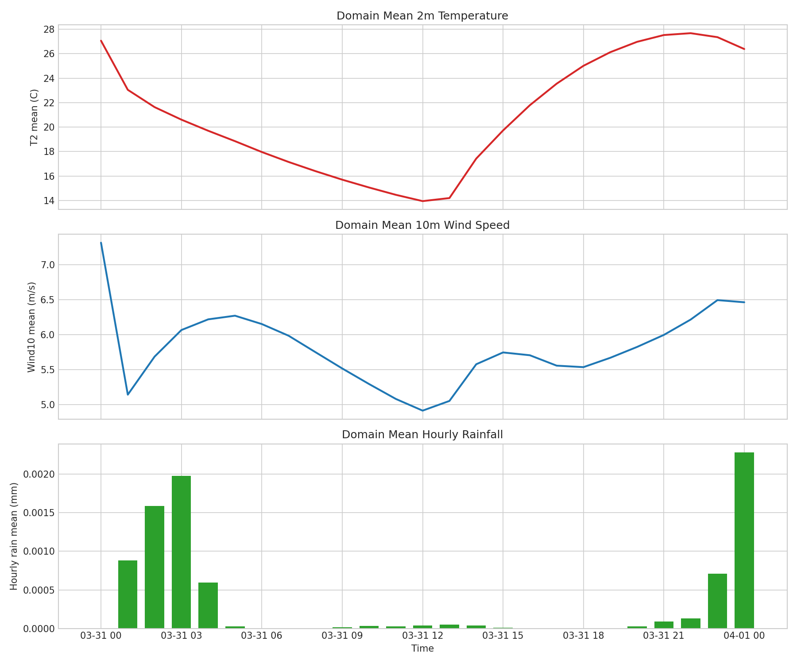
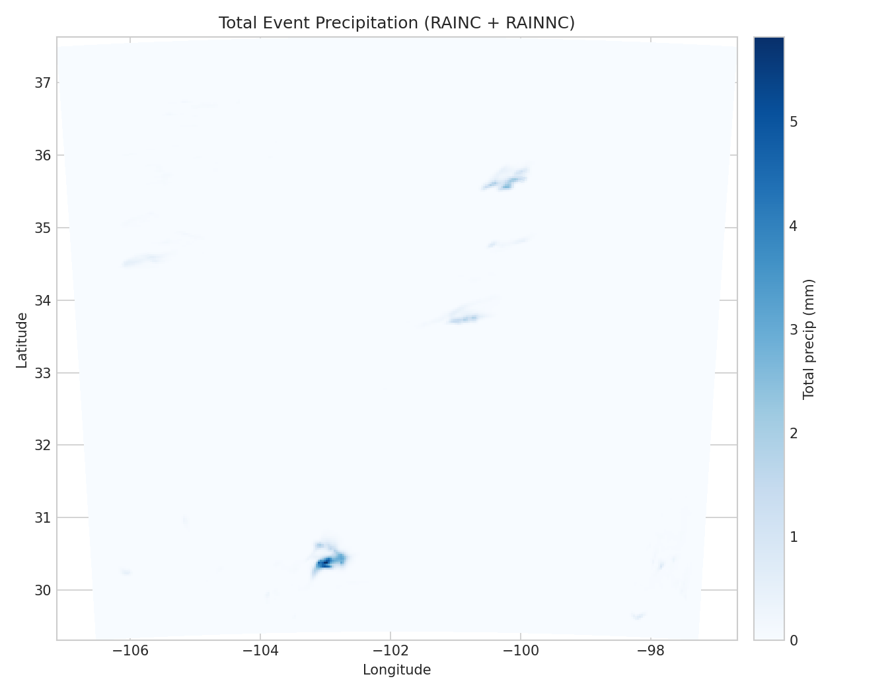
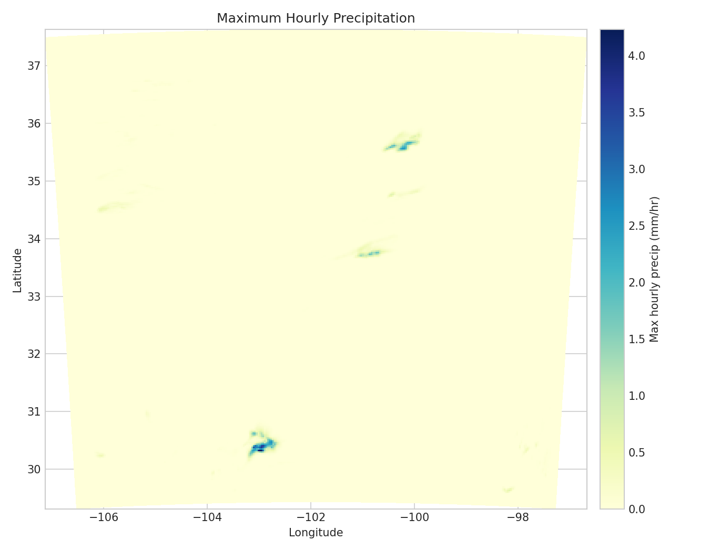
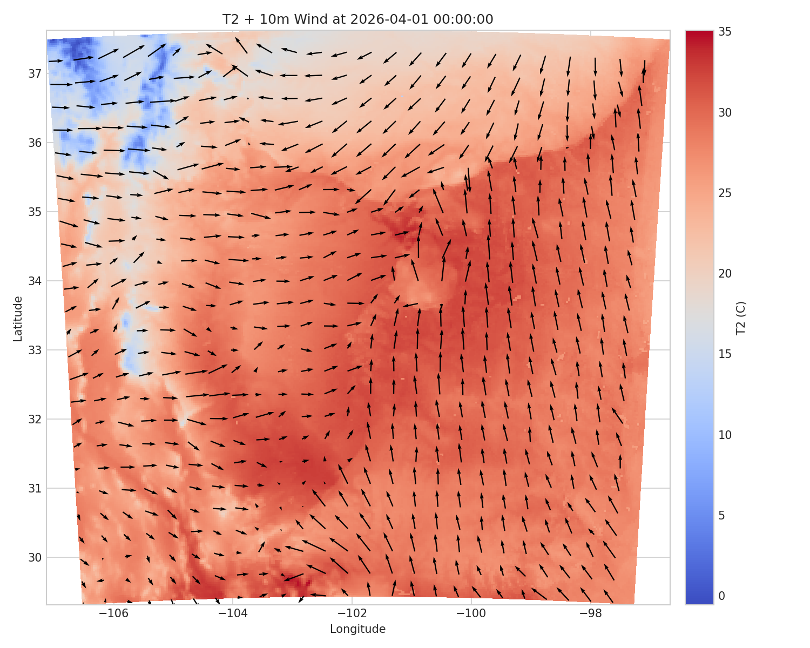

# WRF (ARW) 24-hour Forecast Demo

This repository shows the workflow I used to run a 24-hour WRF forecast with WPS preprocessing.

Large model inputs/outputs are intentionally excluded from GitHub.
I keep those files on HPC storage and commit only scripts, namelists, and small evidence artifacts.

## Case Setup

- WRF version: `4.5.2`
- WPS version: `4.5`
- Domain: `d01`, `301 x 301`, `dx=dy=3 km`
- Forecast window: `2026-03-31 00:00:00` to `2026-04-01 00:00:00`
- Forcing: GFS 0.25 degree files every 3 hours (`f000` to `f024`)

## What Is Tracked in Git

- Workflow documentation: `ReadMe.TXT`
- Namelists and helper scripts
- Small run evidence in `logs/` and `results/meta/`
- Optional light figures in `results/figures/`

## What Is Not Tracked

- GRIB files
- WPS intermediate files (`FILE:*`, `PFILE:*`)
- `met_em*`, `wrfinput*`, `wrfbdy*`, `wrfout*`
- Full WPS/WRF build and run directories

## Reproducibility Workflow

1. Run full workflow on HPC (`geogrid -> ungrib -> metgrid -> real -> wrf`).
2. Generate compact proof artifacts:
   ```bash
   bash collect_evidence.sh
   ```
3. Commit only small artifacts (text summaries, headers, checksums, figures).

## Evidence Included

After running `collect_evidence.sh`, the repository can include:

- `logs/metgrid_success.txt`
- `logs/real_success.txt`
- `logs/wrf_tail.txt`
- `results/meta/run_info.txt`
- `results/meta/checksums.sha256`
- `results/meta/met_em_header.txt` (if `ncdump` is available)
- `results/meta/wrfout_header.txt` (if `wrfout` exists and `ncdump` is available)

These files are small and show that the run completed and produced expected artifacts.

## Notes

- If WRF aborts with `CAMtr_volume_mixing_ratio does not exist`, restore runtime files:
  ```bash
  tar -xzf v4.5.2.tar.gz WRFV4.5.2/run
  ```
- Full outputs remain in HPC storage and can be shared on request.

## Forecast Analysis (March 31-April 1, 2026)

Analysis notebook and table:

- `analysis/notebooks/analysis.ipynb`
- `analysis/data/analysis_summary_timeseries.csv`

Generated figures:

### 1) Domain Mean Time Series
Shows domain-mean 2m temperature, domain-mean 10m wind speed, and mean hourly rainfall across the simulation window.



### 2) Total Event Precipitation Map
Shows total accumulated event rainfall (`RAINC + RAINNC`) at each grid point from start to end of forecast.



### 3) Maximum Hourly Precipitation Map
Shows the highest hourly rainfall reached at each grid cell during the run.



### 4) Snapshot: 2m Temperature and 10m Wind
Shows a selected forecast-time snapshot of near-surface temperature with wind vectors.



### What We Learn from This Run

- The model completed successfully and produced a continuous 24-hour forecast.
- Rainfall behavior can be assessed in both total accumulation and peak hourly intensity.
- Near-surface thermodynamic and wind evolution can be diagnosed from the time series and snapshot fields.
- These plots provide a baseline for future observation-based skill checks (bias, MAE, RMSE).
